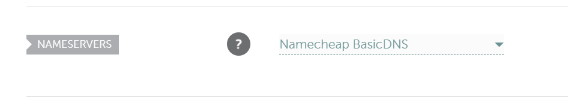
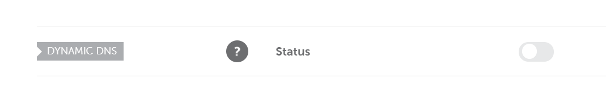
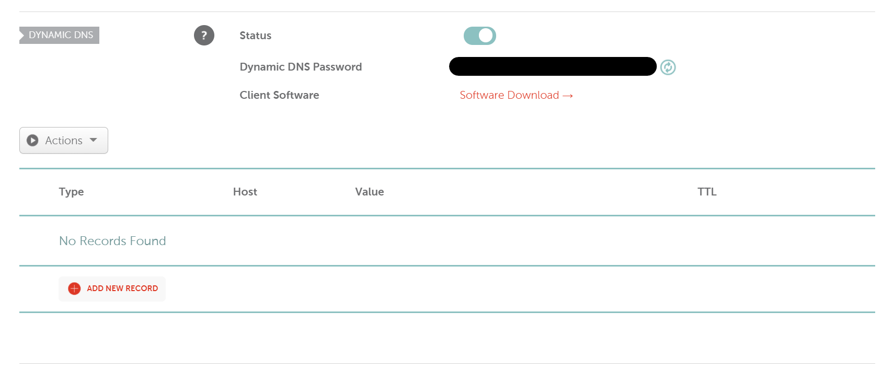
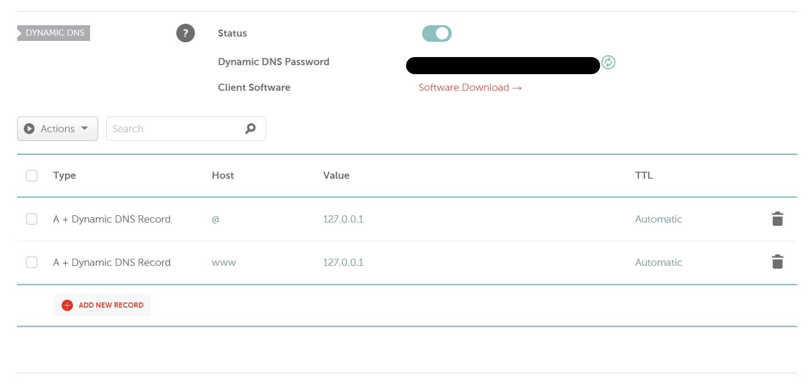

# dynamic-dns - Namecheap Provider

```typescript
// CommonJS
const { NamecheapApi } = require("dynamic-dns");

// ESM
import { NamecheapApi } from "dynamic-dns";
```

## Configure your Namecheap DNS

To start using the Namecheap DynamicDNS API, you need to make sure that the nameservers of your domain is pointed to Namecheap's `BasicDNS`, `PremiumDNS` or `FreeDNS` nameservers.

To verify that, just go into your domain's dashboard and check the `Namesevers` option.

Mine is pointed to Namecheap `BasicDNS` as you can see, here...



After that, you'll be able to go into the `Advanced DNS` tab.
Go to the bottom until you see the `Dynamic DNS` option.

By default, it is turned off as you can see on my default configuration.



Just turn it on and you'll get the informations you need.



Keep the `Dynamic DNS Password`. You'll need it to authenticate your account. By the way, don't show or give it publicly !

Now, **you need to create** the Dynamic DNS records, like so.



So, here imagine I have that domain, `example.com`, the `@` host will refer to `example.com` (root). The `www` will refer to the `www.example.com` sub-domain.

❗ Note that, with this, you can only update records of type `A`.

You can learn more about this API on [its documentation page](https://www.namecheap.com/support/knowledgebase/article.aspx/29/11/how-to-dynamically-update-the-hosts-ip-with-an-http-request/).

## Usage

With their API, you can only update your DynamicDNS records and nothing more. So, the only available function is `updateDnsRecord`.

```typescript
const api = NamecheapApi({
  dynamicDnsPassword: "xxxxxxxxxxxxxxxxxxxxxxxx"
});

try {
  const isUpdated = await api.updateDnsRecord({
    // Domain name as it's written in your dashboard.
    domain: "vexcited.me", 

    // "@" for the root record.
    host: "www", 
    
    // Optional value. If leaved blank, it will update the DNS record with your current IP.
    ip: "127.0.0.1" 
  });

  console.log(isUpdated) // Returns true, if success.
}
catch (e) {
  // If it failed, it will throw an error.
  console.error(e);
  // The error will look like this:

  // Error: [NamecheapAPI] Errors:
  // - No Records updated. A record not Found;
}
```