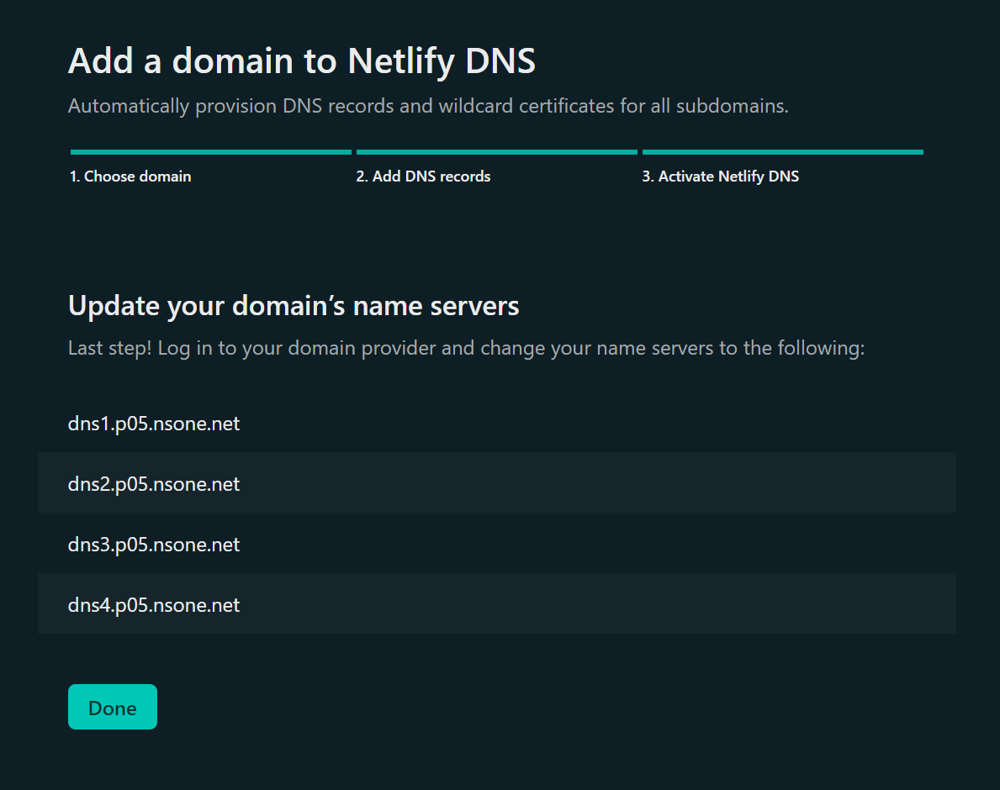
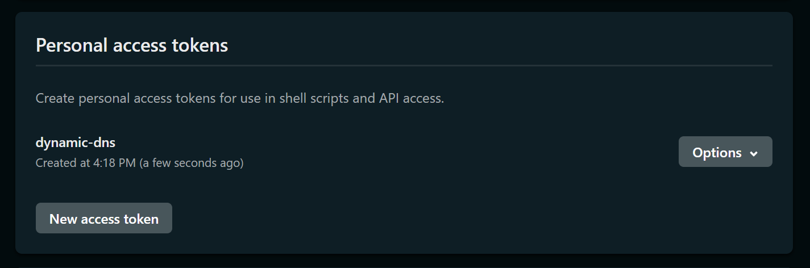

# dynamic-dns - Netlify Provider

```typescript
// CommonJS
const { NetlifyApi } = require("dynamic-dns");

// ESM
import { NetlifyApi } from "dynamic-dns";
```

## Configure your Netlify DNS

They already have [a tutorial on their documentation about how to add a domain to Netlify](https://docs.netlify.com/domains-https/netlify-dns/), so if you are in trouble setting up your domain, go read it.

You should make sure that you had configured properly your domain's nameservers to Netlify one's.

For my domain, I should have used these nameservers...



## Set-up the Netlify Provider

You'll need to [generate a personal access token](https://app.netlify.com/user/applications#personal-access-tokens).

You can name it the way you want and, by the way, **you'll not be able to see your token** again. So store it somewhere safe.



## Usage

Now that you have your personal access token, you'll be able to use the Netlify provider !

```typescript
const api = new NetlifyApi({
  token: "xxxxxxxxxxxxxxxxxxxxxxxxx-xxxxxxx"
});
```

## Zones

### Get Zones

Adapted from <https://open-api.netlify.com/#operation/getDnsZones>.

You can get a list of all the zones that the authenticated user have.

```typescript
try {
  const { resultInfo, zones } = await api.getDnsZones({
    // account_slug: string
  });

  console.info(resultInfo.count, "DNS zones found !");
  
  const myZone = zones[0];
  console.info("First Zone's Name", myZone.rawData.name);
}
catch (error) {
  console.error(error);
}
```

### Get Zone from its ID

Adapted from <https://open-api.netlify.com/#operation/getDnsZone>.

You can get a single zone from its `zone_id`.

```typescript
try {
  const myZoneId = "xxxxxxxxxxxx";
  const myZone = await api.getDnsZoneFromId(myZoneId);
  
  console.info(myZone.rawData.name);
}
catch (error) {
  console.error(error);
}
```

### Get Zone from Site ID

Adapted from <https://open-api.netlify.com/#operation/getDNSForSite>.

You can get the zones that are assigned to a site from its id (`site_id`).

```typescript
try {
  const mySiteId = "xxxxxxxxxxxx";
  const { resultInfo, zones} = await api.getDnsZonesFromSiteId(mySiteId);
  
  console.info(resultInfo.count, "DNS zones found for site ID", mySiteId, "!");
  
  const myZone = zones[0];
  console.info("First Zone's Name:", myZone.rawData.name);
}
catch (error) {
  console.error(error);
}
```

## Zone Methods

Now that you have your DNS Zone, you can perform some methods on it.

### Create DNS record in the zone

Adapted from <https://open-api.netlify.com/#operation/createDnsRecord>.

With this method, you can create a new DNS record inside the zone.

```typescript
const createdRecord = await myZone.createDnsRecord({
  /**
   * Here, "local" will create a record for `local.example.com`,
   * but if you want to create a record for the root domain, just type
   * the root domain, like this "example.com".
   */
  hostname: "local", // Will do "local.example.com".

  /**
   * Can be "AAAA" for IPv6.
   * It can also be "CNAME", "TXT", "ALIAS", "NS", "SPF", ...
   */
  type: "A", 

  /** Value is the content of the DNS record. */
  value: "127.0.0.1"

  /** Optional TTL parameter.
   * ttl: number // Defaults to 3600.
   */
  
  /** Additional parameters for "MX" type.
   * priority: number
   */

  /** Additional parameters for "CAA" type.
   * flag: number,
   * tag: string
   */
  
  /** Additional parameters for "SRV" type.
   * priority: number,
   * port: number,
   * weight: number,
   * service: string,
   * protocol: string
   */
});

console.info("Created DNS Record ID:", createdRecord.rawData.id);
```

### Get all DNS records

Adapted from <https://open-api.netlify.com/#operation/getDnsRecords>.

```typescript
const { resultInfo, records } = await myZone.getDnsRecords();
console.info("Found", resultInfo.count, "DNS record inside the zone.");

records.map(record => {
  console.info(`- ${record.rawData.hostname} (${record.rawData.id})`);
});
```

### Get a DNS record from its ID

Adapted from <https://open-api.netlify.com/#operation/getIndividualDnsRecord>.

```typescript
const myRecordId = "xxxxxxxxxxxxxxxxxx";
const myRecord = await myZone.getDnsRecordFromId(myRecordId);

// Shows its name and its value.
console.info(`${myRecord.rawData.hostname}: (${myRecord.rawData.value})`);
```

### Delete Zone

Adapted from <https://open-api.netlify.com/#operation/deleteDnsZone>.

```typescript
try {
  const isDeleted = await myZone.delete();
  console.log(isDeleted) // true
}
catch (e) {
  // Didn't deleted.
  console.error(e);
}
```

## Record Methods

By the way, there's no "built-in" method to update a DNS record.
So what you can do, is to delete the record (with the method below), and then create a new DNS record in the zone with the same hostname.

### Delete Record

Adapted from <https://open-api.netlify.com/#operation/deleteDnsRecord>.
You can easily delete the DNS record from your zone like this.

```typescript
try {
  const isDeleted = await myRecord.delete();
  console.log(isDeleted) // true
}
catch (e) {
  // Didn't deleted.
  console.error(e);
}
```