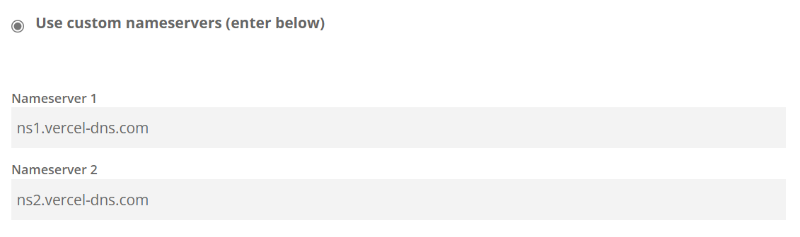

# dynamic-dns - Vercel Provider

```typescript
// CommonJS
const { VercelApi } = require("@vexcited/dynamic-dns");

// ESM
import { VercelApi } from "@vexcited/dynamic-dns";
```

## Configure your Vercel DNS

You have a **full explanation** about the process to **add your domain to Vercel** on [their official documentation](https://vercel.com/docs/concepts/projects/custom-domains#dns-records).

You should also make sure you use the `Nameservers` method. That means that your domain's nameservers should be pointing to the Vercel's nameservers.

My domain's nameservers is configured like this...



## Set-up the Vercel Provider

You'll need to [generate an account token](https://vercel.com/account/tokens).

You can name it the way you want and, by the way, **you'll not be able to see your token** again. So store it somewhere safe.

## Usage

Now that you have your token, you can insert it to the provider like this...

```typescript
const api = new VercelApi({
  token: "xxxxxxxxxxxxxxxxxxx"
});
```

## List the teams

You can directly perform requests to the authenticated user but if you need to access DNS records from domains that are on a different team, you'll need to get the `teamId`.

To do that, you can list all the teams found on the current authenticated user.

This method is adapted from <https://vercel.com/docs/rest-api#endpoints/teams/list-all-teams>. You'll find the documentation for the optional parameters there.

### Example

```typescript
try {
  const { resultInfo, teams } = await api.listTeams({
    // limit: number,
    // since: number,
    // until: number
  });

  console.info(`The authenticated user have ${resultInfo.count} team(s).`);

  // Retrieve the first returned team.
  const myTeam = teams[0];

  // Get the information about it.
  const myTeamId = myTeam.rawData.id;
  const myTeamSlug = myTeam.rawData.slug;
  console.info(`The first team returned is ${myTeamSlug} (${myTeamId}).`);
}
catch (error) {
  // Error handling.
  console.error(error);
}
```

With the returned team class, you can perform every methods listed below.

```typescript
const { resultInfo, domains } = await myTeam.listDomains({
  // Parameters in the "List domains" section.
});

console.info(`The first team have ${resultInfo.count} domain(s).`);
if (resultInfo.count > 0) {
  domains.map(domain => {
    console.log(domain.rawData.id);
  });
}
```

## Domains

Here is some methods to get a domain.

### List Domains

Adapted from <https://vercel.com/docs/rest-api#endpoints/domains/list-all-the-domains>. You'll find the documentation for the optional parameters there.

> `teamId` parameter, in the Vercel's documentation, is automatically filled when using a team class (mentioned above).

```typescript
const { resultInfo, domains } = await api.listDomains({
  // limit: number,
  // since: number,
  // until: number
})

// Check if we have more than one domain.
if (resultInfo.count < 1) return;

const myDomain = domains[0];
```

### Get domain from its name

You can get a single domain with its name.
Adapted from <https://vercel.com/docs/rest-api#endpoints/domains/get-information-for-a-single-domain>.

```typescript
const myDomainName = "example.com";
const myDomain = await api.getDomainFromName(myDomainName);

const myDomainId = myDomain.rawData.id;
console.log(myDomainName, myDomainId);
```

## Domains Methods

Now that you have your domain(s), you can perform some methods on them.

### List DNS records

List every DNS record of this domain.
Adapted from <https://vercel.com/docs/rest-api#endpoints/dns/list-existing-dns-records>.

```typescript
const { records, resultInfo } = await myDomain.listDnsRecords({
  // limit: number,
  // until: number,
  // since: number
})

if (resultInfo.count < 1) return;

// Log the id and name of every records in the domain.
records.map(record => {
  console.log(record.rawData.id, record.rawData.name);
});
```

By the way, you can get a record from its name with this method like this
```typescript
const { records } = await myDomain.listDnsRecords({
  limit: 20
});
const matchingRecords = records.filter(record => record.rawData.name === "local");

// Check if the record exists.
if (matchingRecords.length > 0) {
  const myRecord = matchingRecords[0]; // Here is your domain.
  console.info("DNS Record ID:", myRecord.rawData.id);
}
else {
  console.error("DNS Record not found.");
}
```

### Update DNS record from ID

Update a DNS record directly from its ID.
This method was made to prevent listing every records to update only one record.

```ts
const recordId = "rec_xxxxxxxxxxxx";
const newRecord = await myDomain.updateRecordFromId(recordId, {
  // Options are the same as `createDnsRecord`, see below.
});

// `newRecord` is the new content of the record.
``` 

### Delete DNS record from ID
Delete a DNS record directly from its ID.
This method was made to prevent listing every records to delete only one record.
```ts
const recordId = "rec_xxxxxxxxxxxx";
const isDeleted = await myDomain.deleteRecordFromId(recordId);

// If no error, `isDeleted` is true.
``` 

### Create DNS record

Create a new DNS record in this domain.
Adapted from <https://vercel.com/docs/rest-api#endpoints/dns/create-a-dns-record>.

`ttl` parameter is optional. Its minimum and default value is 60 and its maximum value is 2147483647.

`MX` and `SRV` record types aren't supported actually because they implies some parameters that aren't typed and checked in this library (`priority` for both and `srv` object for SRV type).

```typescript
try {
  // `uid` is the ID of the created record.
  const { success, uid } = await myDomain.createDnsRecord({
    type: "A",
    value: "127.0.0.1",
    name: "local",
    ttl: 60
  });
  
  if (success) {
    console.info(`Created a new record into ${myDomain.rawData.name}. Its RecordID is ${uid}`);
  }
}
catch (e) {
  // Record didn't created.
  console.error(e);
}
```

### Delete domain

You can easily delete the domain from your Vercel account.
Adapted from <https://vercel.com/docs/rest-api#endpoints/domains/remove-a-domain-by-name>.

Returns `true` if okay. If not, it throws an error.

```typescript
try {
  const isDeleted = await myDomain.delete();
  console.log(isDeleted); // true
}
catch (e) {
  // Domain didn't deleted.
  console.error(e);
}
```

## DNS Record Methods

Now that you have a DNS record (from `listDnsRecords`), you can perform methods on this DNS record.

### Update DNS record

You can update the current DNS record.
Every parameters are optional.

**By the way, you can't change the type of a DNS record.**

```typescript
// This will update the value of the DNS record.
const updatedRecord = await myRecord.update({
  value: "127.0.0.2",
  // name: string,
  // ttl: number (with 60 > number > 2147483647)
});

// Note that `myRecord` and `updatedRecord` aren't the same, now.
console.log(updatedRecord.rawData.id);
```

### Delete DNS record

You can easily delete the DNS record from its domain.
Adapted from <https://vercel.com/docs/rest-api#endpoints/dns/delete-a-dns-record>.

Returns `true` if okay. If not, it throws an error.

```typescript
try {
  const isDeleted = await myRecord.delete();
  console.log(isDeleted); // true
}
catch (e) {
  // DNS record didn't deleted.
  console.error(e);
}
```

## Example Usage

```typescript
try {
  // const { teams } = await api.listTeams({
  //   limit: 2
  // });

  // const myTeam = teams[0];
  // console.log("Team's Name:", myTeam.rawData.name);

  const myDomain = await api.getDomainFromName("example.com");
  console.log("Domain ID:", myDomain.rawData.id);

  const { records, resultInfo } = await myDomain.listDnsRecords({
    limit: 20
  });
  console.info("Found", resultInfo.count, "record(s) !");

  records.map(record => {
    console.log("Slug:", record.rawData.slug, "; ID:", record.rawData.id);
  });
}
catch(e) {
  console.error(e);
}
```
